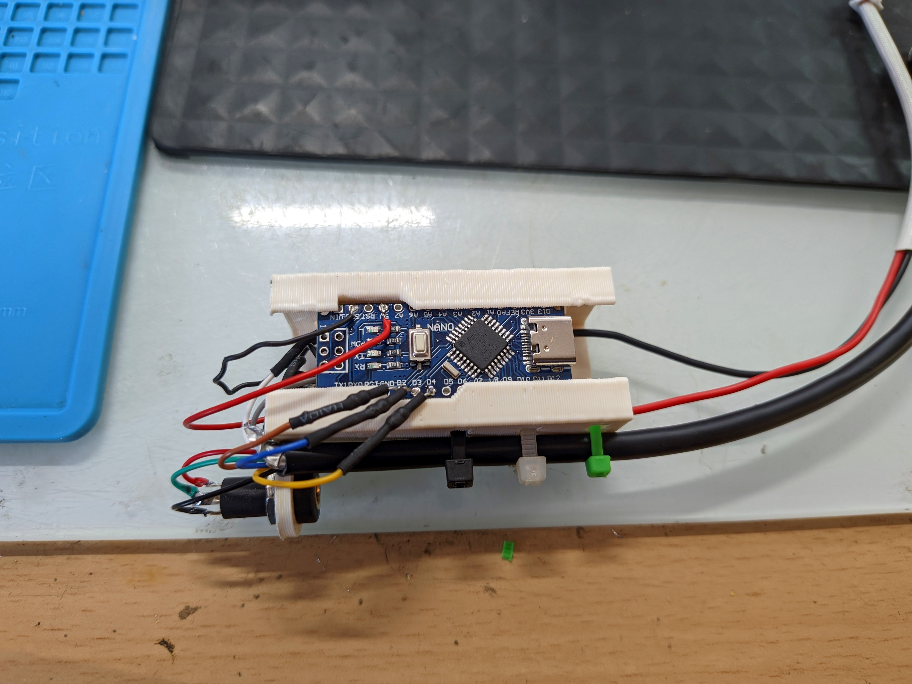
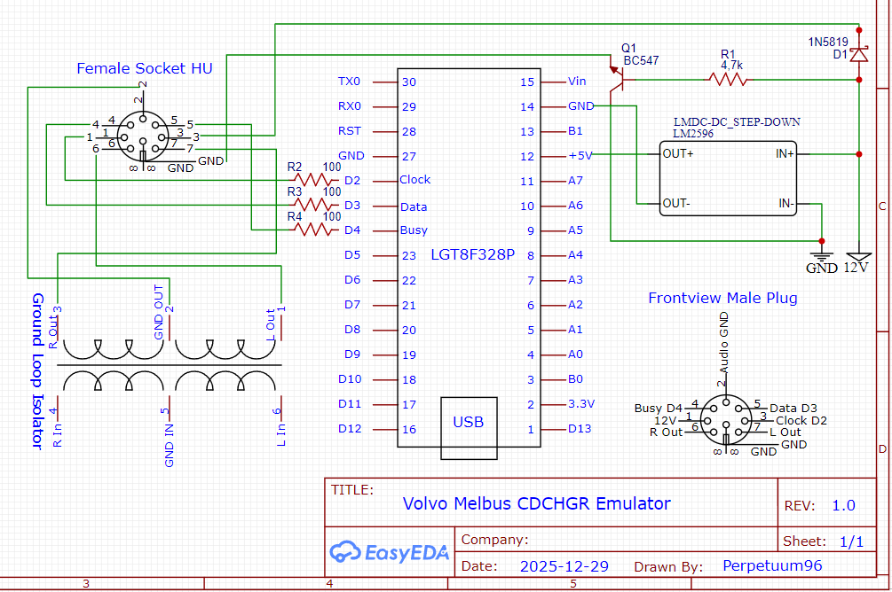

# Volvo Melbus CD-Changer Emulator  for LGT8F328P

This project emulates the MELBUS communication of a factory CD-changer for Volvo HU-xxxx head units (e.g., V70, S60, S80).

It allows you to enable the "10-CD Changer" source on your radio to use as an AUX input via the 8-pin DIN contact.

This specific version is optimized for the LGT8F328P (a cheaper Arduino Nano alternative) and features modified pin assignments to utilize the correct hardware interrupts.

Also works on Arduino Nano, tested with Arduino Nano clone.

---

## Overview
The Head Unit (HU) enables the CD-CHGR in its source menu after a successful initialization.

To remain active, the emulator must respond to the HU's secondary initialization every time the car starts.

> [!IMPORTANT]
> **Clock Speed:** You must set the LGT8F328P to **16 MHz** in the Arduino IDE (Board Settings) for the timing to work correctly.
>
> **Interrupt Mapping:** This version is specifically modified to use **Pin D2 (INT0)** as the Clock pin, making it compatible with LGT8F328P and Nano clones that require specific hardware interrupt mapping.

---

## 🛠 Hardware Setup

### 📦 Parts List
| Component | Purpose |
|:---|:---|
| **LGT8F328P** | Microcontroller (Nano Clone). |
| **LM2596 Step Down** | Provides stable 5V power from the car's 12V system. |
| **IN 5819 Schottky Diode** | Prevents phantom power on LGT8F328P when cigarette socket is off. |
| **BC547 NPN-Transistor** | 12V to Melbus when cigarette socket is on. |
| **3x 100Ω Resistors** | Protection for Melbus signal lines (CLK, DATA, BUSY). |
| **1x 4,7kΩ Resistor** | Pull-up/Base resistor for transistor circuit. |
| **8-Pin DIN Plug** | 90° Male, 270° configuration for Volvo HU connector. |
| **AUX Socket / Jack** | 3.5mm female stereo connector for audio input. |
| **Ground Loop Isolator** | Eliminates engine noise/hum from the AUX audio signal. |
| **[3D-Printed Case](https://www.printables.com/model/1627612-volvo-aux-melbus-cd-changer-emulator-arduino-nano)** | Custom enclosure for a clean installation. |

---
### 🔌 Schematics & Wiring

## Changelog (LGT8F328P Adaptation)
Compared to the original Melbus_Mitsubishi_HU.ino:
- Interrupt Logic: MELBUS_CLOCKBIT_INT changed from 1 to 0 (Mapping to D2).
- Register Access: Direct manipulation of EIMSK and EIFR updated from INT1 to INT0 for faster interrupt handling.
- Port Mapping: Verified bitwise operations on DDRD, PORTD, and PIND for the new pin configuration (D2, D3, D4).

## 📚 Credits & Sources

* **[Karl Hagström (klalle)](https://gist.github.com/klalle/1ae1bfec5e2506918a3f89492180565e) (2015):** The original mastermind behind the Melbus CD-Changer emulation logic. His [blog post](http://gizmosnack.blogspot.se/2015/11/aux-in-volvo-hu-xxxx-radio.html) is the foundation of this project.
* **Sebastian Zeller (2016):** Key code modifications and timing improvements.
* **[visualapproach](https://github.com/visualapproach/Volvo-melbus/):** Excellent documentation and modern Arduino implementation of the Melbus protocol.'

---

## ⚠️ Disclaimer & Safety
**Use this project at your own risk!**
- Working on car electronics can damage your Head Unit (HU) or the vehicle's electrical system if done incorrectly.
- **Short Circuit Risk:** The Melbus connector provides constant 12V power. Always disconnect the battery or the radio fuse before connecting your DIY adapter.
- I am not responsible for any damage to your vehicle, radio, or person.
- Double-check your wiring and solder joints before plugging it in!

---
